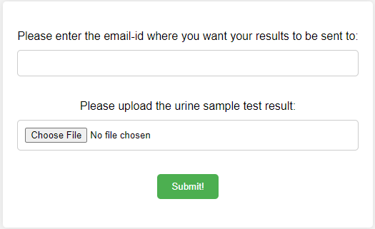
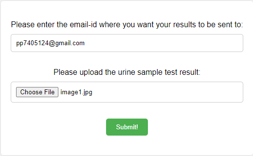
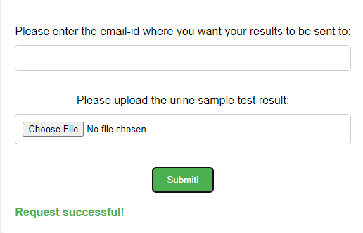
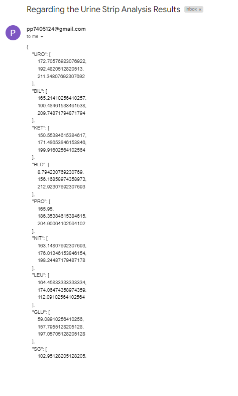
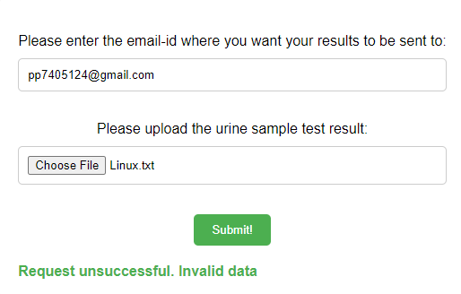

# Strip Sample Analyzer


The Strip-Sample-Analyzer is a DjangoREST application that analyzes urine sample test results to identify the colors on the strip. The Urine test strip is a basic diagnostic tool used to determine pathological changes in a patient's urine in standard urinalysis. 

The project presents a web interface that the users interacts with to upload the image. Shortly after, the results are mailed to the user on their email account. The result contains the colors that are identified as part of the strip test results. 


## Technical Details
**Client:** HTML, CSS, JavaScript

**Server:** DjangoREST, Celery, Redis, Docker, OpenCV, Numpy, Pillow


The frontend of the application was created using simple HTML, CSS and Vanilla JavaScript.

The backend of the application was created using DjangoREST, Celery, Redis, Docker, OpenCV, Numpy, Pillow

DjangoREST was used to create an API for the frontend to react with. The frontend sends in a request to the API which takes in an image and uses OpenCV, Numpy, Pillow. It would recognize the RGB colors present in the strip.

Celery and Redis are used as background task processors. Since image processing is an intensive task, it was decided that a background task processor was necessary to maintain the performance of the application. Without it, the application would face significant latency with medium to high traffic demands. The application would process the image on the background and send an email to the user with the test results as part of the email body.


## Installation

Clone the github repository 

```
    git clone https://github.com/Jay179-sudo/Strip-Sample-Analysis
```

Firstly, setup a SMTP service for Django to use

```
    cd Backend
    touch .env
```
The required fields for the SMTP service are

```
    EMAIL_HOST
    EMAIL_USER
    EMAIL_HOST_PASSWORD
    EMAIL_FROM
```


Launch Docker Engine

```
    cd Backend
    docker-compose up -d --build
```

Launching the Frontend

```
    cd Frontend
```
Open index.html


    
## Usage and Examples

Home Page

The home page welcomes you to the application. Here, you can input an email to deliver the test results to and select the image for analysis. 



Image Upload

An example of the filled form.



Successful Request

State of the application once a successful request is made.



Email Result 

An example of the result delivered via email. 



Invalid Data input

Example of an invalid data input




## Authors

- Jay Prasad
